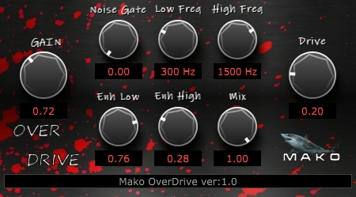

# MakoOD
* A demo JUCE VST guitar OverDrive pedal.
* Demo JUCE program.
* Tested on Windows only.
* Written in Visual C++ 2022.
* Written for new programmers, not complicated.
* Version: 1.00
* Posted: June 13, 2024

VERSION
------------------------------------------------------------------
1.00 - Initial release.

DISCLAIMER
------------------------------------------------------------------  
This VST was written in a very simple way. Just simple code for
people who are not programmers but want to dabble in the magic of JUCE VSTs.

If you are new to JUCE code, the Mako Thump VST may be a better
starting place. Or be brave and try this. This VST is not too hard to get.
       
SUMMARY
------------------------------------------------------------------
A Juce/C++ VST3 written to create an OverDrive distortion effect. 

# THEORY OF OPERATION 
OVERDRIVE
An overdrive effect is designed to give a guitar or other instrument a little extra boost/distortion.
It is used in front of an amplifer or amp simulator when a little more drive is needed.

This overdrive operates close to a famous OD called the Nobles OD. The Nobles has a Low/High filter section that lets
the user form a section of frequency to boost. Many notable ODs boost 700 Hz. This OD takes that 700 Hz concept and spreads
it out over more frequencies.

In addition to a normal OD, this VST adds some extra distorting stages.
* Enhanced Low - Pushes 450 Hz after all of ther gain stages.
* Enhanced High - Pushes 1350 Hz before gain to retain crispness.

Since it is assumed this VST will be used in front of other amp sims, a noise gate was added to reduce the number of VST stages required.

There is also a MIX knob that lets the user mix in some cleaner sound to the distorted sound. Just another thing to give the user as many
options as possible to create the sound they want.  

BACKGROUND IMAGE  
This VST uses a custem made background image. The file is included in the ZIP. Any images must be added to the PROJUCER project file so
they can be embedded into the C++ project. In the Editor PAINT function, the background can be skipped and a normal UI drawing section used.

CUSTOM SLIDERS  
This VST overrides the standard JUCE slider control drawing function. This allows us to make a psuedo realistic knob in place of a slider.
This is accomplished by creating our own LOOKANDFEEL class based off the JUCE class. We then override the normal function.

